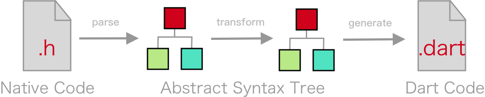

# dart_native_codegen

Generate Dart bindings from native code. It's based on [dart_native](https://pub.dev/packages/dart_native).

You can use codegen to convert native SDK into Flutter SDK. Such as Login SDK:

Codegen is a part of DartNative. It's the cyan part(DartNative Codegen) in the picture below:

It's still under development. Here's how it works:

